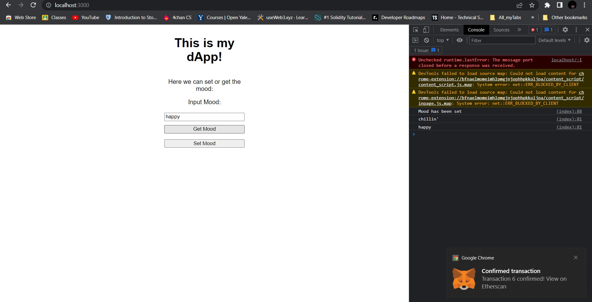

# MoodSetter  

LearnWeb3's Freshman dApp.

To run the Project :
1. Download the repo.
2. Open command prompt and navigate to project location.
3. Use the command 
```
npm run lite
```
4. Go to http://localhost:3000/ and check out the Project.

